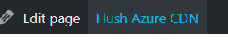

# PR-crisis WordPress microsite - resources

## Architecture
Idea is based on publishing static HTML exports outside VM - visitors don't interact with our WP, but with files in Azure CDN.

VM with LAMP installation is isolated and accessible via VPN (or at least protected by IP filter) for redactors only. WP is configured for another URL (e.g. mysite-administration.acme.company). Thanks to this setup, redactors are able to preview their work before publishing.

When is redactor satisfied with all articles, triggers WP2Static plugin to generate static HTML files to special folder located on VM file system.

On VM is also deployed systemd service - this service waits until hook from our custom Wordpress plugin, that HTML is finished (our middleware between WP2Static and systemd), and synchronize all these files with blob storage (origin of CDN) by Shared access secret (SAS) token. If something fails at this moment, end users are not affected, because Azure CDN cache have not been invalidated yet.

When are output files checked that everything is ok, redactor is able trigger invalidation of Azure CDN cache directly from WP user interface thanks to our custom WP plugin. Changes will take effect within 15 minutes for end users.

## Recommended Azure configuration

### Azure CDN
1. set up Rules engine to redirect traffic from HTTP to HTTPS

    `If Request protocol Operator "Equals" Value "HTTP", Then URL Redirect Type "Found(302)" protocol "HTTPS"`

1. create Custom domain also for www. prefix
1. set up Rules engine to redirect traffic from www. prefix (in case of subdomain)

    `If Request URL Operator "Begins with" Request URL "http://www.myweb.company" Case transform "To lowercase", Then URL redirect Found (302) Protocol (HTTPS) Hostname (myweb.company)`
    
    and

    `If Request URL Operator "Begins with" Request URL "https://www.myweb.company" Case transform "To lowercase", Then URL redirect Found (302) Protocol (HTTPS) Hostname (myweb.company)`

### Azure Blob Storage
1. do not forget to set up CORS as you need on website

## WP2Static configuration
- Detection level = As much as possible
- Destination URL = real URL of your website
- Target Directory = `/var/www/staticexport/$web`

## WordPress plugin

Plugin adds button to purge Azure CDN Cache (via Azure REST API) from WP user interface. Also helps to server to detect, what new export is finished - creates file `uploads/deploy.txt`

#### Installation
- Upload plugin and activate it

- Fill in needed variables in `plugin.php`

## systemd script - detect new WP2Static export

Script detects when new export is finished and uploads on Blob storage.

#### Requirements
- `azcopy` tools - [how to install]([https://blog.elazem.com/2019/07/21/installing-azcopy-v10-on-linux)

#### Installation
- Copy files `deployer.path, deployer.service` from `deployer-script/` folder into `/etc/systemd/system`

- Copy file `deployer-script/deploy-to-azs.sh` folder into `/root/` 

- Fill in needed variables in `deploy-to-azs.sh`

- Run:

  <code>
    chmod +x /root/deploy-to-azs.sh

    systemctl daemon-reload

    systemctl start deployer

    systemctl enable deployer
  </code>

---

## Architecture - HA version
If you want to protect the solution against outage of Azure region, you can place in front of solution also service <i>Azure Traffic Manager</i>, and for VM replication <i>Azure Site Recovery</i> and double whole solution in other region(s).

## Credits
- Vaclav Jirovsky (https://www.vjirovsky.cz)
- Vladimir Smitka (https://www.lynt.cz)
